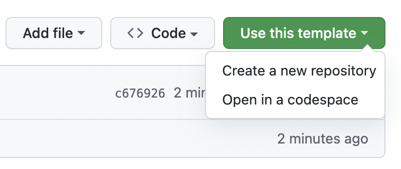

# HippoTech 2.0 - GitHub Demo

Take Seeker for a spin in GitHub in a matter of seconds with the hottest new startup in tech: HippoTech 2.0. There's nothing to install: it all runs in the cloud in GitHub Codespaces.

Questions and feedback are welcome! Send it to <mtolley@synopsys.com>. 

## Getting Set Up

### Create your personal repository from the template

Click **Use this template**, then click **Create a new repository**



Name it anything you like. It can be a public or a private repository. Click **Create repository from template**. Now you have your own HippoTech repository to work with.

### Configure Seeker

You'll need to provide two pieces of information to configure Seeker:

1. The URL of your Seeker server.
1. The Project Key for the Project you wish to use.

If you don't have a Seeker Project set up and ready to use, go ahead and create one now.

Once you have these details you can set them as secrets for your GitHub Codespace. Navigate to Settings -> Secrets and variables -> Codespaces and click on **New repository secret**. 

1. Create a repository secret named SEEKER_SERVER_URL.
1. Create another repository secret named SEEKER_PROJECT_KEY.

If your setup looks like this:


you're all set!

## The Tech Stack

HippoTech 2.0 is a Single Page Application (SPA) written in React/JavaScript. The SPA reaches out to an API server with an OpenAPI, RESTish interface, which is currently implemented in Java. Here's a glimpse of what you have to look forward to:


There are end-to-end automated tests written using the excellent **[Cypress](https://cypress.io)** testing framework. This author does not enjoy testing asynchronous client-side code, but thankfully Cypress makes it much easier.

## Up And Running

It's a Java application, so you'll need a JVM: at least Java 11. Just grab the latest release and run 

`java -jar api.jar`

This will serve the entire application (the API back-end and the React frontend) locally on port 3001. The port number is pretty much hard-wired today so if that doesn't work out for you, unfortunately, you will need to *make* it work. Sorry about that. 

Make sure it's up and running on <http://localhost:3001>.

## Logging In

There are instructions in the user interface on the login page, but not everybody sees 'em so:

Username: siguser@synopsys.com
Password: password

## Features

### Apply for an Agreement In Principle

This is the core workflow in HippoTech. Hit **GET ME A MORTGAGE**, log in if you haven't already, and you will get a short wizard asking you some questions about the property you wish to buy, payment details for a $1 USD fee, etc. The only real validation is on the purchase price and the amount you wish to borrow. HippoTech processes mortgages from $200k to $1M USD, so the purchase price will need to be in that range. HippoTech does not process loans of less than $100k, so the amount-to-borrow needs to be in the $100-900k range. And less than the value of the property, of course!

One you complete the application, your new request for consideration will be visible in My Mortgages.

### My Mortgages

Click on the burger icon on the top left and you will see My Mortgages. If you navigate to this feature you will see a list of all mortgage applications you have previously made - a couple have already been seeded - and view the history of those applications including any relevant events. You also have the opportunity to withdraw an application that you have previously made.

### The Blog


Click on the burger icon on the top left and you will see a link to the Blog. 

#### Subscription

There's a **SUBSCRIBE** button on the Blog home page: this will give you the opportunity to add your email address to the distribution list. This is entirely theoretic - no emails will be sent.

#### The Stories

There are three blog posts, of which you can see a summary on the Blog home page. If you click **continue reading** you will be taken to the full blog post.

#### Comments

Once you navigate to the full blog post, you will see any comments that have been left on that post by HippoTech's highly-engaged customer community. If you're logged in, you will also have the opportunity to leave your own comments. But please keep them respectful!

## How To Build

There are two parts to the HippoTech system: 

1. The React front-end, located in `/hippotech-react`
1. The Java back-end, located in `/java-api`

You **must** build HippoTech in that order. The back-end actually takes the front-end build and includes it in the final application. If you don't build the front-end first, the SPA will be missing from the application and you will only have the API.

### Building The Frontend

You will need Node.js. HippoTech has only been tested with Node 16.x, but other versions may work. If you have another, incompatible version of Node.js and need to change it up: use  AKA Node Version Manager. 

```
cd hippotech-react
npm install
npm run build
```

### Building The Backend

Will will need JDK 11 or higher and Maven. You must build the frontend first! Then:

```
cd java-api
mvn package
```

This will generate a fat JAR: `target/api.jar`. You can run this as described in *Up And Running* above:

`java -jar target/api.jar`

## Tests

HippoTech 2.0 comes with a suite of end-to-end tests using the **[Cypress](https://cypress.io)** testing framework. The tests can be run headless (ideal for CI/CD pipelines) or interactively. 

### Headless

```
cd hippotech-react
npx cypress run
```

### Interactive

```
cd hippotech-react
npx cypress open
```

### Cypress Dependencies

You may not need anything extra to run the end-to-end tests, but Cypress does have some dependencies. If it turns out your system can't run Cypress out of the box, check out the Cypress docs here: <https://docs.cypress.io/guides/getting-started/installing-cypress> for guidance on what to install.

On Ubuntu this should do the trick:

`apt-get install libgtk2.0-0 libgtk-3-0 libgbm-dev libnotify-dev libgconf-2-4 libnss3 libxss1 libasound2 libxtst6 xauth xvfb`

## HippoTech Microservices

So far we have been building and running a single, monolithic Java application. You can also build and run the microservices version of HippoTech which will include several back end services:

* Approval (Java)
* Blog (Node.js)

There is no need to build and run these services locally: this will all be taken care of by Docker Compose.

### Docker Compose

If you take a look in the default `docker-compose.yml` file you will see a number of containers:

* hippotech - the front end (basically just a repackaging of the Java API and React UI)
* approval  - a back-end service written in Java to handle mortgage approval requests
* blog      - the back-end blog subscription service written in Node.js
* mongo     - the NoSQL database used by the blog service

You can build and run the microservices version of HippoTech with Docker Compose by running:

```
docker-compose build --no-cache
docker-compose up
```

Once running you can either interact with HippoTech through its exposed port (3001 as always), or you can run the automated test suite. You can either do this by running the test suite locally as described above, or by pulling in an additional Docker Compose configuration file to run the tests headless:

`docker-compose -f docker-compose.yml -f docker-compose-tests.yml up`

### Docker (work in progress, ignore for now)

You can build the HippoTech docker container image with the following command:

`docker build -t hippotech:latest .`

Or use whatever tag you prefer, of course. And then run it locally with:

`docker run --rm hippotech:latest -p 3001:3001`

One of the advantages of this approach is that you don't need any of the build tools, since that takes place inside Docker images. One you're up and running you can still run tests, but in that case you'll still need to have Node, and run `npm install` inside `hippotech-react`. Alterntatively, you can run the docker image *and* immediately run the Cypress tests inside that same image with the following command:

`docker run --rm -p 3001:3001 hippotech:latest bash -c "./start.sh && cd /hippotech-react && . /usr/local/nvm/nvm.sh && npx cypress run"`

In this case the container will exit as soon as the tests complete.