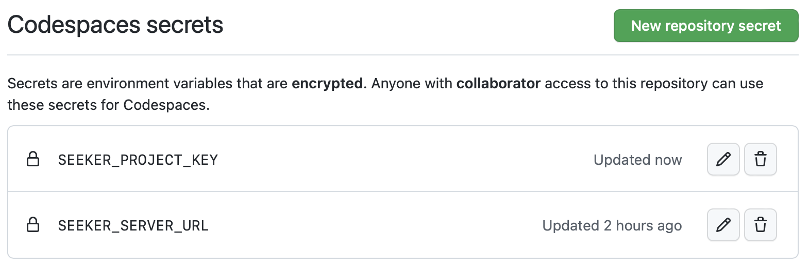
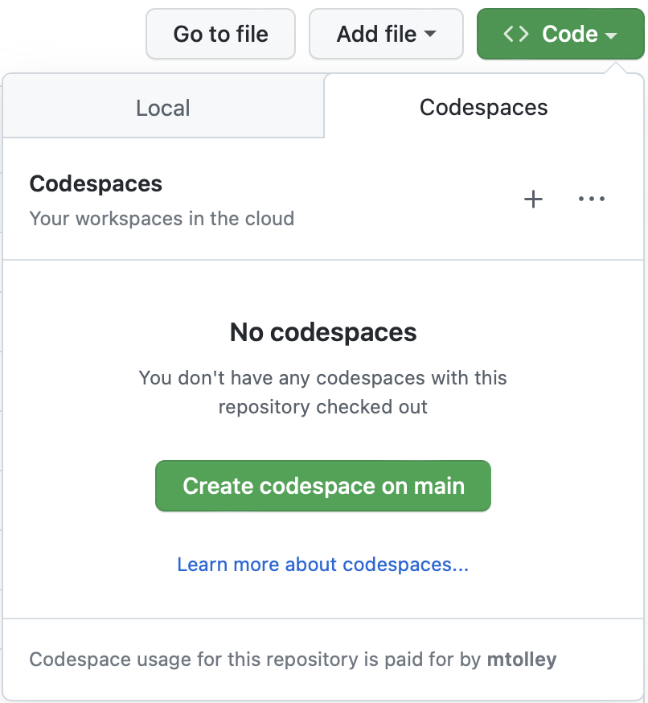

# HippoTech 2.0 - GitHub Demo

Take Seeker for a spin in GitHub in a matter of seconds with the hottest new startup in tech: HippoTech 2.0. There's nothing to install: it all runs in the cloud in GitHub Codespaces.

Questions and feedback are welcome! Send it to <mtolley@synopsys.com>. 

## Getting Set Up

### Create your personal repository from the template

Click **Use this template**, then click **Create a new repository**

Name it anything you like. It can be a public or a private repository. Click **Create repository from template**. Now you have your own HippoTech repository to work with.

### Configure Seeker

If you don't have a Seeker Project set up and ready to use, go ahead and create one now. 

Once you have these details you can set them as secrets for your GitHub Codespace so that Seeker knows where the server is located, and what project you're testing. Navigate to Settings -> Secrets and variables -> Codespaces and click on **New repository secret**. 

1. Create a repository secret named SEEKER_SERVER_URL.
1. Create another repository secret named SEEKER_PROJECT_KEY.

If your setup looks like this:

you're all set!

## Testing HippoTech 2.0 with Seeker in GitHub Codespaces

Open your new repository in GitHub CodeSpaces by clicking on the **Code** button, the **Codespaces** tab, and finally **Create codespace on main**. This will launch a brand new codespace for your repository.

You'll need to wait a minute or two for the environment to be fully created and for the HippoTech application to start. Port forwarding is set up to port 3001 and once the application is available you'll be able to access it by clicking on the ports tab and then the internet/globe icon which will open a new browser window. It does take a minute to start, so if you get an error page to start with just give it a moment, or check out the application logs in `hippotech.log`.

## The HippoTech 2.0 Application

HippoTech 2.0 is a Single Page Application (SPA) written in React/JavaScript. The SPA reaches out to an API server with an OpenAPI, RESTish interface, which is currently implemented in Java. Here's a glimpse of what you have to look forward to:

You can test it manually by logging in and navigating around the application, or you can launch the accompanying automated test suite by running `./run-tests.sh` in the terminal window. You can For manual test instructions, read on!

## Features

If you're looking for the quickest route to one of the most classic Application Security vulnerabilities, there's no need to log in: just click on the menu on the top left, select Blog, and hit subscribe. Enter an email address and you'll find that this feature is vulnerable to SQL Injection. 

### Logging in

There are instructions in the user interface on the login page, but not everybody sees 'em so:

Username: siguser@synopsys.com
Password: password

### Apply for an Agreement In Principle

This is the core workflow in HippoTech. Hit **GET ME A MORTGAGE**, log in if you haven't already, and you will get a short wizard asking you some questions about the property you wish to buy, payment details for a $1 USD fee, etc. The only real validation is on the purchase price and the amount you wish to borrow. HippoTech processes mortgages from $200k to $1M USD, so the purchase price will need to be in that range. HippoTech does not process loans of less than $100k, so the amount-to-borrow needs to be in the $100-900k range. And less than the value of the property, of course!

One you complete the application, your new request for consideration will be visible in My Mortgages.

### My Mortgages

Click on the burger icon on the top left and you will see My Mortgages. If you navigate to this feature you will see a list of all mortgage applications you have previously made - a couple have already been seeded - and view the history of those applications including any relevant events. You also have the opportunity to withdraw an application that you have previously made.

### The Blog

Click on the burger icon on the top left and you will see a link to the Blog. 

#### Subscription

There's a **SUBSCRIBE** button on the Blog home page: this will give you the opportunity to add your email address to the distribution list. This is entirely theoretic - no emails will be sent. You'll probably

#### The Stories

There are three blog posts, of which you can see a summary on the Blog home page. If you click **continue reading** you will be taken to the full blog post.

#### Comments

Once you navigate to the full blog post, you will see any comments that have been left on that post by HippoTech's highly-engaged customer community. If you're logged in, you will also have the opportunity to leave your own comments. But please keep them respectful!
